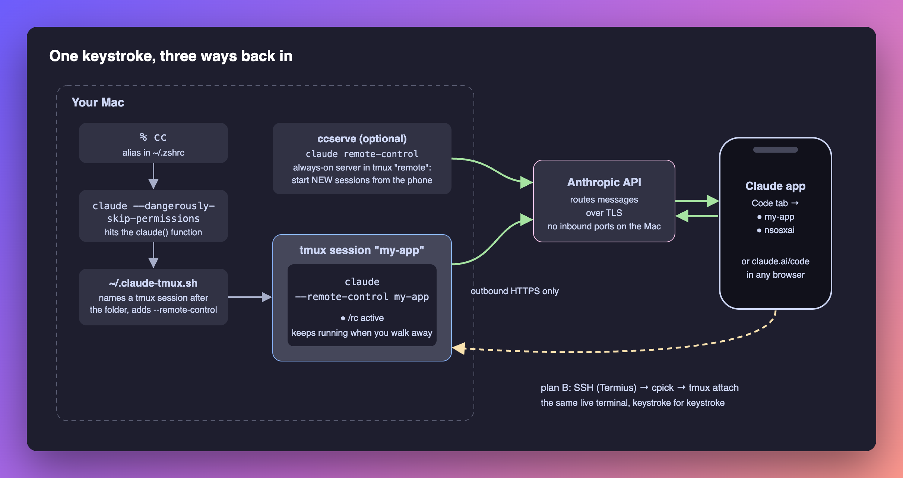
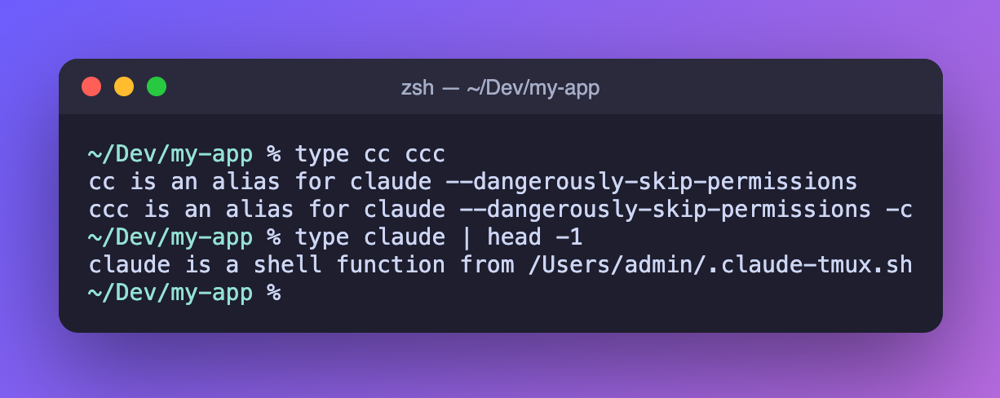
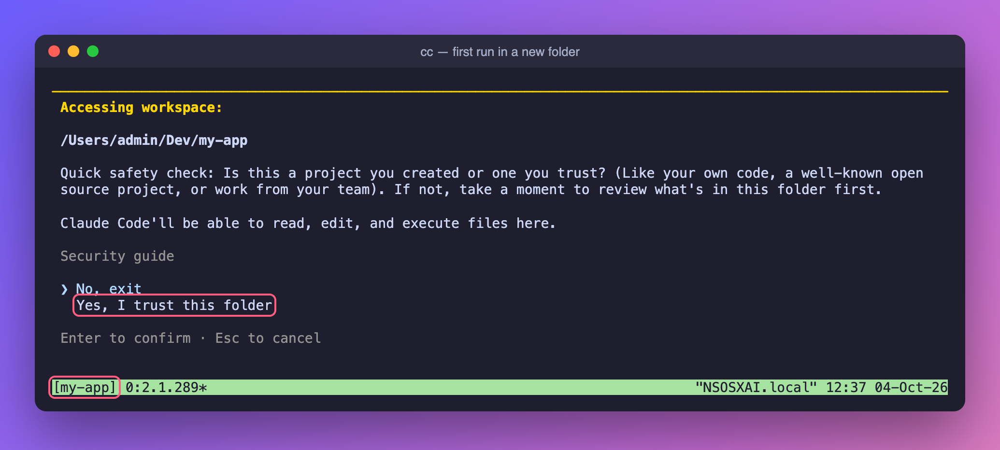
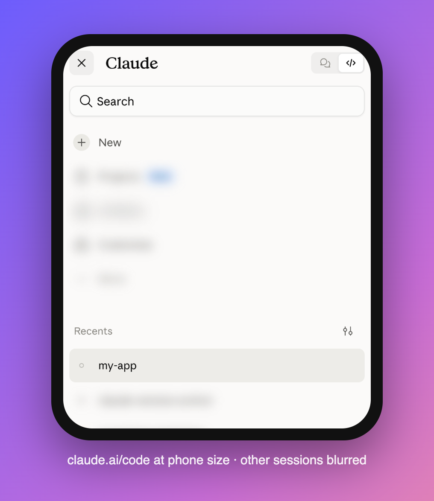
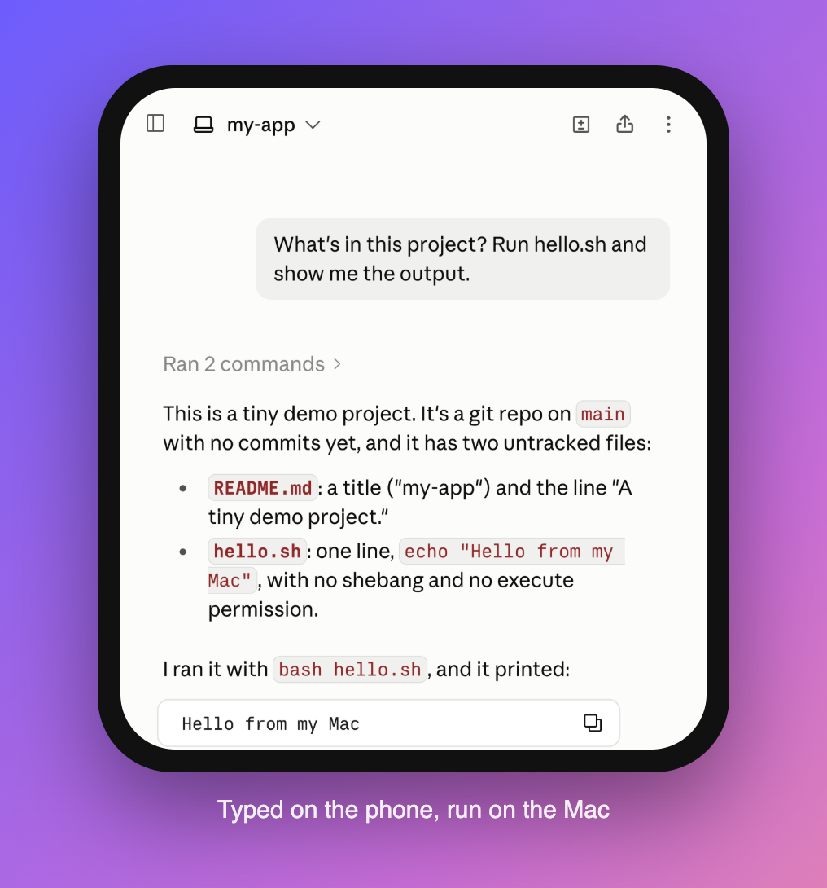
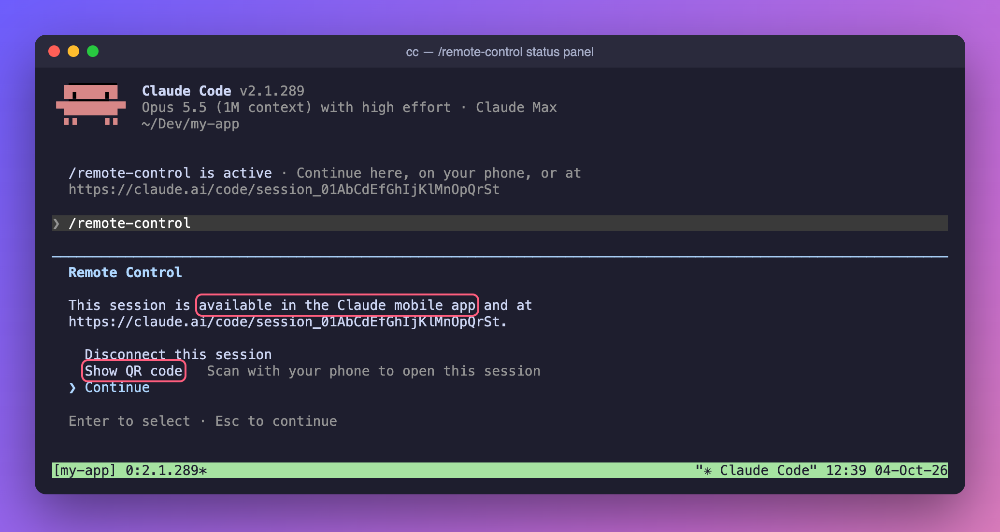
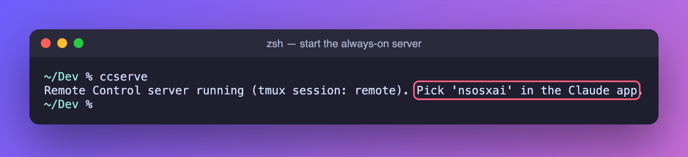
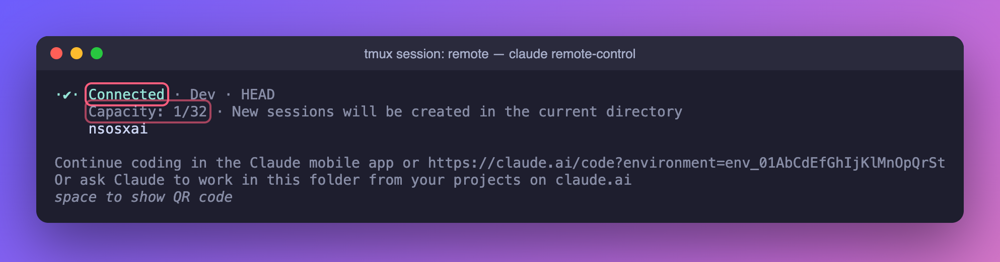
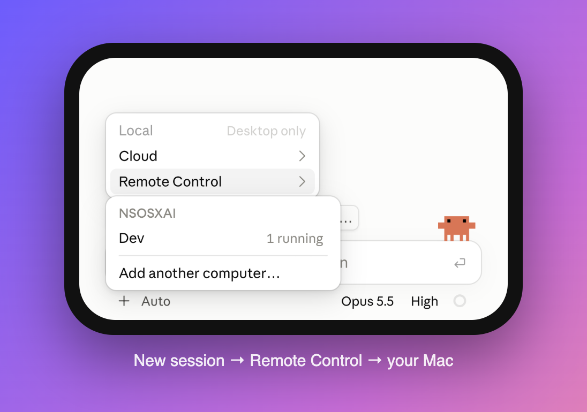
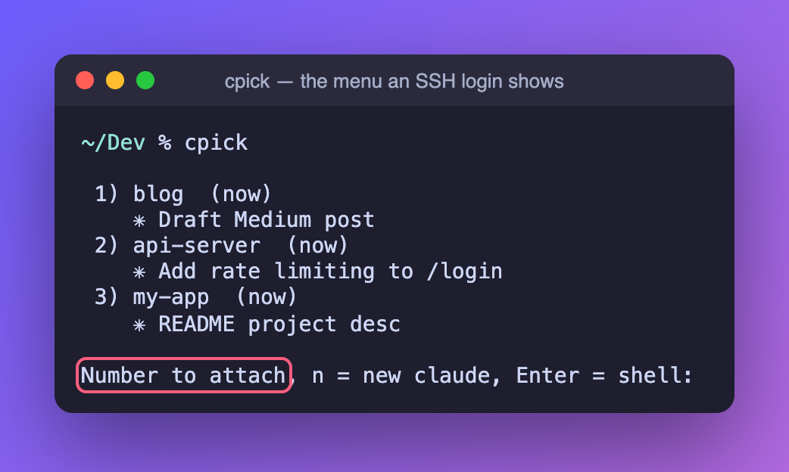

# I Type Two Letters on My Mac and Keep Coding From My Phone

*Claude Code, Remote Control, a six-line tmux config and one shell function. The exact setup, step by step.*

---

I start most of my work the same way. I open a terminal, `cd` into a project and type:

```
cc
```

That's it. Claude Code starts in its own tmux session named after the folder, with **Remote Control** already on. When I get up from my desk, the same live session is in the **Claude app** on my phone under the same name. I can read what it did, answer its questions, approve the next step or give it a new task while I'm in line for coffee.

If the app is ever not enough, I can SSH in from the phone and attach to the same terminal, keystroke for keystroke.

This article shows the whole setup so you can copy it. Everything is in a repo with an installer and tests: **[github.com/YOLOVibeCode/claude-remote-control](https://github.com/YOLOVibeCode/claude-remote-control)**.



## What you get

1. **The terminal.** Claude Code runs on your Mac with your files, tools and MCP servers.
2. **The Claude app or claude.ai/code.** Remote Control mirrors that session to your phone or any browser. Messages, tool calls and questions stay in sync both ways.
3. **SSH (optional).** Because every session lives in tmux, you can attach to it from any SSH client.

## What you need

- A Mac (any recent macOS; zsh is the default shell).
- **Claude Code** installed and signed in with a **Pro, Max, Team or Enterprise** plan. Remote Control does not work with API keys, so make sure `ANTHROPIC_API_KEY` isn't set in your shell. On Team and Enterprise, an Owner has to turn Remote Control on in the Claude Code admin settings.
- **tmux**: `brew install tmux`
- The **Claude app** for iOS or Android, signed in to the same account.
- Optional, for plan B: an SSH app such as Termius, plus Remote Login turned on in macOS.

---

## Step 1: Check Claude Code and install tmux

```bash
claude --version        # this guide was written on 2.1.289
brew install tmux
tmux -V
```

If you've never signed in, run `claude` once and type `/login`.

## Step 2: Add the `cc` alias

In `~/.zshrc`:

```bash
alias cc="claude --dangerously-skip-permissions"
alias ccc="claude --dangerously-skip-permissions -c"   # continue the last conversation
```

Then `source ~/.zshrc` and check that both aliases are there:



The second line of that screenshot is the important part. `claude` is no longer just the binary. It's a **shell function**, and you'll add it in the next step. Aliases expand before functions run, so `cc` goes through the wrapper too.

> ⚠️ `--dangerously-skip-permissions` means Claude runs commands and edits files without asking. With Remote Control on, a phone can trigger that. Read the **Safety** section before you copy this. If you'd rather keep the prompts, drop the flag. Everything else in this guide still works.

## Step 3: Add the wrapper that makes every session remote-controllable

This is the core of the setup. Save it as `~/.claude-tmux.sh` (the full file is in the repo at [`shell/claude-tmux.sh`](shell/claude-tmux.sh)):

```bash
claude() {
  # Pass straight through when already in tmux, not on a terminal, or tmux is missing.
  if [ -n "$TMUX" ] || [ ! -t 0 ] || [ ! -t 1 ] || ! command -v tmux >/dev/null 2>&1; then
    command claude "$@"; return
  fi
  # Pass through print mode, help/version, and subcommands (a lone word like `mcp`, `doctor`).
  case $1 in
    -p|--print|-h|--help|-v|--version) command claude "$@"; return ;;
    -*|'') ;;
    *[!A-Za-z0-9-]*) ;;
    *) command claude "$@"; return ;;
  esac
  local a
  for a in "$@"; do
    case $a in -p|--print) command claude "$@"; return ;; esac
  done

  local base name i=2
  base=$(basename "$PWD" | tr -c 'A-Za-z0-9_\n-' '-')
  name=$base
  while tmux has-session -t "=$name" 2>/dev/null; do name=$base-$i; i=$((i+1)); done
  # Remote Control lets the Claude app / claude.ai/code drive the same session, under the same name.
  local rc="--remote-control"
  for a in "$@"; do
    case $a in --remote-control*) rc="" ;; esac
  done
  if [ -n "$rc" ]; then
    tmux new-session -s "$name" -c "$PWD" -e "PATH=$PATH" claude "$rc" "$name" "$@"
  else
    tmux new-session -s "$name" -c "$PWD" -e "PATH=$PATH" claude "$@"
  fi
}
```

And source it at the end of `~/.zshrc`:

```bash
[ -f "$HOME/.claude-tmux.sh" ] && . "$HOME/.claude-tmux.sh"
```

What it does:

| You type | What happens |
| --- | --- |
| `cc` in `~/Dev/my-app` | A new tmux session `my-app` runs `claude --remote-control my-app --dangerously-skip-permissions` |
| `cc` again in the same folder | The name is taken, so you get `my-app-2`, then `my-app-3` |
| `claude -p "…"`, `claude mcp list`, `claude --version` | Runs directly. Scripts and subcommands never get wrapped |
| anything while already inside tmux | Runs directly. No tmux inside tmux |
| `claude --remote-control other-name` | Your name wins and the flag is not added twice |

**Why not just turn on "Enable Remote Control for all sessions"?** Claude Code has that setting too (`/config`, or `remoteControlAtStartup: true`). It turns Remote Control on, but it doesn't put the session in tmux or name it after the folder. The tmux part is what keeps a session alive when you close the terminal window, and what makes plan B (SSH) possible.

## Step 4: Six lines of tmux config

`~/.tmux.conf`:

```
set -g mouse on            # scroll with trackpad or finger; plain drag copies (hold Shift in Ghostty, Fn in Terminal.app, Option in iTerm2 for the terminal's own selection)
set -g history-limit 50000
set -sg escape-time 10     # Esc reaches Claude immediately
set -g set-titles on       # terminal tab shows the session's title
set -g set-titles-string '#S: #T'
if-shell "command -v pbcopy >/dev/null" "set -s copy-command pbcopy"
```

`escape-time` matters most. tmux's default delay makes **Esc**, which interrupts Claude, feel broken.

The first and last lines work as a pair. `mouse on` lets you scroll Claude's output with the trackpad, or with your finger over SSH. The catch is that tmux then takes over click-and-drag, so the terminal's own selection and ⌘C stop working. The last line fixes that: anything you select in tmux (a drag, a double-click on a word, a triple-click on a line) goes straight to the macOS clipboard, ready for ⌘V. A few things to know:

- **Ctrl+C isn't copy on a Mac.** In Claude Code it interrupts. Copy with a drag, or use ⌘C after a Shift- or Fn-drag.
- **Every selection replaces your clipboard,** including accidental drags. If Handoff is on, it also syncs to your iPhone through Universal Clipboard, so don't drag across API keys.
- **Over SSH, the text lands on the Mac's clipboard,** because that's where tmux runs.
- **Leave `set-clipboard` at its default.** Setting it to `on` would let any program running inside tmux write to your clipboard. That includes commands Claude runs without asking.

## Step 5: Type `cc`

Open a **new** terminal, go to a project and type `cc`.

The first time you use a folder, Claude Code asks whether you trust it. This happens once per folder. Choose **Yes, I trust this folder**:



Then you're in. Three things to notice:

![Claude Code running with "/remote-control is active", the /rc indicator, and the tmux status bar showing [my-app]](docs/images/03-session.png)

- **`/remote-control is active`**: the session is already registered and available on your phone. The link under it opens the session at claude.ai/code. (I've replaced the session ID in these screenshots. Treat yours as private.)
- **`/rc`** in the footer: Remote Control is connected.
- **`[my-app]`** in the green bar: you're inside a tmux session named after the folder.

If Remote Control is ever off, for example in a session you started some other way, type `/remote-control` (or `/rc`) and it connects that session.

## Step 6: Pick it up on your phone

On your phone, open the **Claude app**, tap **Code**, and find `my-app` in the session list. Remote Control sessions show a computer icon with a **green dot** when they're online.



Tap it, and you're in the same conversation. I typed this message on the phone. Claude ran `hello.sh` on the Mac, and the reply showed up in both places:



Prefer a QR code? In the terminal, type `/remote-control` again to open the status panel, then pick **Show QR code**:



Now type on the phone. The terminal on your Mac updates at the same time, and the other way around. Your Mac does the work, with your files, git, MCP servers and dev tools. The phone is just a window into it.

Two tips:

- **Push notifications:** run `/config` and turn on **Push when Claude decides** and/or **Push when actions required**. Claude will ping your phone when a long task finishes or when it needs you. You can also just ask: *"notify me when the tests pass."*
- **Keep the Mac awake.** Remote Control reconnects after sleep, but a sleeping Mac does no work. On a MacBook, turn on *System Settings → Battery → Options → Prevent automatic sleeping on power adapter when the display is off*, or run `caffeinate -i` for the length of a job.

## Step 7 (optional): `ccserve`, to start new sessions from the phone

Everything so far mirrors a session you started on the Mac. To start a brand-new session from the couch, run Claude Code's Remote Control **server**. `~/.claude-tmux.sh` includes a helper for it:

```bash
ccserve() {
  # …
  tmux new-session -d -s remote -c "${CCSERVE_DIR:-$HOME/Dev}" -e "PATH=$PATH" \
    claude remote-control --name "$(hostname -s | tr 'A-Z' 'a-z')" --permission-mode bypassPermissions
}
```



It runs in a background tmux session called `remote`. Attach with `tmux attach -t remote` to see it:



Now your Mac shows up in the Claude app as an environment named after its hostname. New sessions you start there run on the Mac, up to 32 at once. Restart it with `ccserve restart` and stop it with `tmux kill-session -t remote`.

To use it, start a new session, open the environment menu and pick **Remote Control**. Your Mac is listed by hostname, with the folder the server runs in:



## Step 8 (optional): Plan B, SSH straight into the same terminal

Sometimes you want the raw terminal: a full-screen TUI, a stuck prompt, or a quick `git log`. Because every session lives in tmux, you can attach to it from any SSH client.

1. On the Mac, turn on **System Settings → General → Sharing → Remote Login**.
2. On the phone, add the Mac as a host in an SSH app (I use Termius). On your home network, its `.local` name works. Away from home, use a private network like Tailscale rather than opening port 22 to the internet.
3. Connect. `~/.claude-tmux.sh` sees `$SSH_CONNECTION` and shows the **`cpick`** menu right away:



Type a number to attach. You're now in the same Claude Code session that's on your Mac screen and in the Claude app. Detach with **Ctrl-b d** and the session keeps running. `NOMENU=1` skips the menu, and you can run `cpick` by hand whenever you like.

---

## Step 9 (optional): Keep every session alive through outages and reboots

The day the network drops for an hour, or the Mac reboots for an update, every tmux session is
gone. Starting them again by name is the trap: `claude --remote-control my-app` opens a *new*,
empty conversation, and the chat you were driving from your phone is still there, just no longer
attached to anything. Pin each session to its conversation instead, and restart with
`--resume <conversation-id>`: same chat, same folder, same name on the phone.

That is what `claude-rc` does. `./install.sh --supervise` records every running session, and a
launchd job runs every 10 minutes and at login. It restarts what died, checks that each session
is on the conversation it is supposed to be (alive is not the same as useful), retypes
`/remote-control` into an idle session whose link dropped, and texts you once per change. A
daily email lists every session and its state, which is how you notice the quiet failures.
Alerts and the email go through whichever provider you configure (Twilio, SMTP, SendGrid, or your
own relay). See the README's Supervision section for the commands and the config.

## How I actually use it

- **Kick off, walk away.** "Upgrade the dependencies, run the test suite, fix what breaks, and notify me when it's green." Then I go do something else.
- **Answer questions from anywhere.** When Claude asks me to choose between two approaches, it shows up as a push notification and I answer from the phone.
- **Review before I'm back.** I read the diff summary in the app, ask for changes, and only open the laptop to merge.
- **Several projects at once.** Each project is its own named tmux session, so the Claude app's list reads like my desk: `api-server`, `blog`, `my-app`.

## Safety: read this before you copy the alias

This setup trades safety prompts for speed. Be deliberate about it.

- **What `--dangerously-skip-permissions` means:** Claude can run any shell command and edit any file it can reach, without asking. With Remote Control, anyone who can drive your Claude account's sessions can trigger that on your Mac.
- **Turn on Trusted Devices.** On Pro and Max, turn on **Require trusted devices** in your claude.ai settings. Then a phone or browser has to be enrolled, and occasionally pass Face ID or Touch ID, before it can view or steer a Remote Control session.
- **Only trust folders you mean to.** The trust prompt in Step 5 is a real decision. Don't trust your home directory.
- **Keep secrets out of reach.** Don't paste API keys into prompts or commands. A command you approve can be saved verbatim in your permission allowlist in `~/.claude/settings.json`, key and all. Use a secrets manager and read keys into variables.
- **Git is your undo button.** Commit often, and let Claude work on branches.
- **Want the prompts back?** Install with `./install.sh --safe`, or press **Shift+Tab** in a session to cycle permission modes. Remote Control works the same either way.
- **Kill switch:** the `disableRemoteControl` setting turns Remote Control off completely.

Remote Control itself only makes **outbound HTTPS** connections from your Mac. It never opens an inbound port. Traffic goes through the Anthropic API over TLS, using short-lived credentials that each cover one purpose.

## Troubleshooting

| Symptom | Fix |
| --- | --- |
| `Remote Control requires claude.ai subscription auth` | An API key is in use. `unset ANTHROPIC_API_KEY` (and check `apiKeyHelper` / `ANTHROPIC_AUTH_TOKEN`) |
| Remote Control won't start behind a gateway | `ANTHROPIC_BASE_URL` points away from `api.anthropic.com`. Unset it |
| `Remote Control isn't enabled for this account` | Run `claude auth logout`, then `claude auth login`. `claude doctor` names the failing check |
| Session missing from the app | Check the `/rc` footer. Type `/remote-control` to reconnect or show the URL |
| `cc` doesn't start tmux | Open a new terminal, and check that `type claude` says *shell function* |
| Esc is laggy | `set -sg escape-time 10` in `~/.tmux.conf`, then `tmux kill-server` |

## Get the code

```bash
git clone https://github.com/YOLOVibeCode/claude-remote-control.git
cd claude-remote-control
./install.sh          # or: ./install.sh --safe
```

The installer backs up anything it replaces, never adds a duplicate block to your `~/.zshrc`, and can undo itself with `./install.sh --uninstall`. `tests/run.sh` checks the wrapper's behavior in bash and zsh against stub `claude` and `tmux` binaries, and CI runs it on macOS and Linux.

### Or have your AI set it up for you

Don't want to do any of this by hand? Paste this into your terminal:

```bash
claude "Set me up with https://github.com/YOLOVibeCode/claude-remote-control — follow the 'For AI agents' steps in its README."
```

Claude checks your prerequisites, clones the repo and asks whether you want permission prompts on or off. Then it runs the installer and the tests and tells you what to do next. The quoted sentence works in any coding agent too: Cursor, Codex, Copilot and the rest.

Two letters, and the session follows you.
